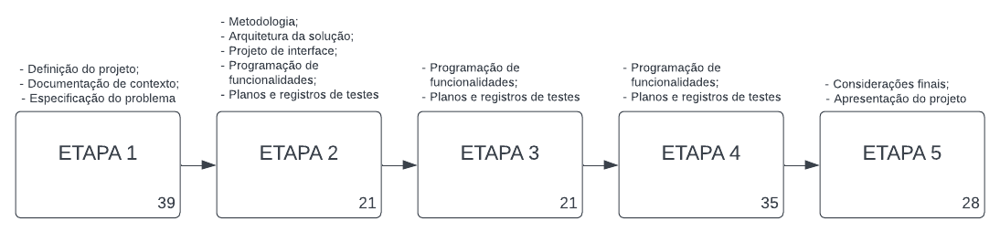
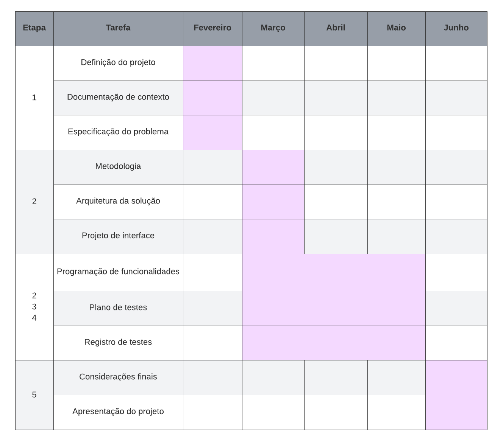
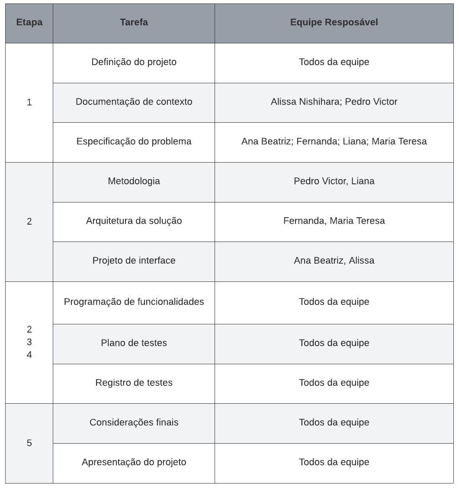
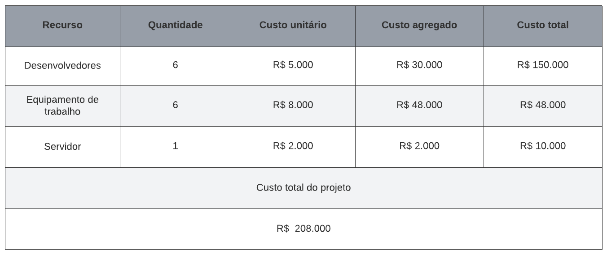

# Especificações do Projeto

## Personas

Grupo de pessoas que busca uma rede de pesquisa para encontrar parceiros para seus Pets.

|Samantha Nogueira   | Informações:                          | **Problema**               |     
|--------------------|----------------------------------|--------------------------------------|
|  | **Idade:** 23 anos      **Sobre**:  Jovem adulta. Mora sozinha desde os 18 e se sentia maior parte do seu dia sozinha e ansiosa. Ganhou Zeca aos 18 de seus pais, para que lhe fizesse companhia durante sua nova fase.  | Samantha ao sair para o trabalho, percebe que Zeca se sente muito sozinho. A mesma por receio, gostaria de encontrar uma parceira para ele, com a mesma idade e raça, para que ela conseguisse um dos filhotes para fazer companhia a Zeca e mantivesse contato com a parceira.    |
|**•Informações do PET:**  ●	Nome: Zeca  ●Idade: 5 anos  ● Raça: Corgi  ●È vermifugado e com vacinas em dia: SIM |**Hobbies,História:**  ● •	Samantha é uma jovem adulta independente. Começou a sua vida sozinha aos 18 anos e desde então tem Zeca como seu companheiro e amigo do dia a dia.   |

|Fernanda Ribeiro   | Informações:                          | **Problema**               |     
|--------------------|----------------------------------|--------------------------------------|
|  | **Idade:** 27 anos      **Sobre**: Fernanda é dona de Maya, na qual tem como sua fiel amiga desde os 19 anos, que a acompanha em suas aventuras em viagens e trilhas.  | Fernanda vê que Maya ao chegar em uma certa idade precisa de um parceiro/amigo e devido o seu pouco conhecimento da região, vem encontrando dificuldades de um bom amiguinho para sua companheira.   |
|**•Informações do PET:**  ●	Nome: MAYA  ●Idade: 8 ANOS  ● Raça: Vira-Lata   ●È vermifugado e com vacinas em dia: SIM |**Hobbies, História:**  ● Fernanda tem uma paixão por viajar e conhecer novos lugares, devido a sua rotina frenética, leva sua maior companheira em todas as viagens que faz   |

## Histórias de Usuários

Com base na análise das personas forma identificadas as seguintes histórias de usuários:

|EU COMO... `PERSONA`| QUERO/PRECISO ... `FUNCIONALIDADE` |PARA ... `MOTIVO/VALOR`                 |
|--------------------|------------------------------------|----------------------------------------|
|Samantha  | Buscar perfis de acordo com a preferência          |Filtrar a pesquisa para ser mais objetiva  |
|Fernanda     | Ter informações sobre a localidade do outro <b>PET</b>   | Saber a localização para encontro |
|Samantha     | Registrar informações sobre seu cão   |Para segurança ao escolher outro pet.|
|Fernanda     | Manter contato com o outro usuário    |Permite melhor troca de informações |
|Samantha    | Atualização de perfil para novos registros | Para ter informações mais atualizadas sobre a saúde do <b>PET</b>  |
|Fernanda     | Realizar cadastro de mais de um <b>PET</b>   | Para encontrar outros pares para seus outros <b>PETS</b>  |
|Samantha     | Adicionar fotos ao perfil              | Permite melhor visualização/conhecimento do parceiro para seu <b>PET</b> . |

## Modelagem do Processo de Negócio 

### Análise da Situação Atual

Diante da dificuldade de tutores ao tentar encontrar parceiros ideais da mesma raça para cruzamento com seus <b>pets</b> , surgiu a necessidade da criação do aplicativo PetLovers para ajudar os tutores que procuram por uma experiência eficaz, amigável e segura para seus pets.

### Descrição Geral da Proposta

A proposta do aplicativo PetLovers é oferecer uma plataforma onde seja possível conectar de forma fácil, dinâmica e segura tutores de cachorros que buscam por <b>pets</b>  compatíveis para cruzamento, para uma reprodução responsável e garantindo o bem-estar animal.

### Processo 

## Indicadores de Desempenho

Apresente aqui os principais indicadores de desempenho e algumas metas para o processo. Atenção: as informações necessárias para gerar os indicadores devem estar contempladas no diagrama de classe. Colocar no mínimo 5 indicadores. 

|INDICADOR|OBJETIVOS|DESCRIÇÃO|CÁLCULO|FONTE DADOS|PERSPECTIVA|
|-------------|-------------|-------------|-------------|-------------|-------------|
|Total de cadastros realizados|Acompanhar o crescimento de acessos à plataforma|Monitorar o número de usuários cadastrados|Número de perfis no banco de dados|Banco de dados|Crescimento da aplicação|
|Número de downloads|Acompanhar o crescimento do aplicativo|Obter o número de vezes em que o aplicativo foi baixado|Número de downloads|Loja de aplicativos|Crescimento da aplicação|
|Índice de satisfação do usuário|Melhorar a experiência do usuário|Análise de feedback sobre o aplicativo|Média das classificações dos usuários|Pesquisa de satisfação|Satisfação do usuário|
|Taxa de retenção de usuários|Manter e aumentar a base de usuários|Mede a porcentagem de usuários que retornam à aplicação regularmente após o primeiro uso|Relação entre usuários ativos no mês atual e novos usuários no mês|Banco de dados|Engajamento e fidelidade dos usuários|
|Taxa de correspondência de raças (matchs)|Aumentar as chances de encontros bem sucedidos|Mede a porcentagem de correspondências entre donos de cachorros da mesma caça|(Número de correspondências bem sucedidas/total de tentativas de correspondência)x100%|Registro de interações na aplicação/banco de dados|Eficácia da aplicação|

Obs.: todas as informações para gerar os indicadores devem estar no diagrama de classe a ser apresentado a posteriori. 

## Requisitos

As tabelas que se seguem apresentam os requisitos funcionais e não funcionais que detalham o escopo do projeto. 

### Requisitos Funcionais

|ID    | Descrição do Requisito  | Prioridade |
|------|-----------------------------------------|----|
|RF-001| O sistema deve possuir uma área para fazer cadastro de novos usuários a partir de 18 anos. | ALTA | 
|RF-002| O sistema deve permitir cadastrar o perfil de um animal de estimação, com a opção de fazer o upload de imagens.  | ALTA |
|RF-003| O sistema deve possibilitar ao usuário a modificação ou exclusão de suas informações cadastradas, bem como as relacionadas ao seu <b>pet</b>.| MÉDIA |
|RF-004| O sistema deve ter uma área para buscar/filtrar e visualizar o perfil de outros <b>pets</b>.  | MÉDIA |
|RF-005| O sistema deve permitir que o usuário consiga selecionar (dar <b>like</b>) ou recusar perfis de outros <b>pets</b>.| ALTA|
|RF-006| O sistema deve emitir notificação ao usuário quando acontece um <b>match</b>. | ALTA |
|RF-007|  O sistema deve exibir um ícone de mensagens instantâneas para os usuários que deram <b>match</b>. | ALTA |
|RF-008| O sistema deve permitir que os usuários avaliem a experiência. | MÉDIA |
|RF-009| O site deve incluir uma página de login. | ALTA |

### Requisitos não Funcionais

|ID     | Descrição do Requisito  |Prioridade |
|-------|-------------------------|----|
|RNF-001|	Na página principal, deve-se deixar claro o propósito do site |	MÉDIA |
|RNF-002|	O sistema deve ser responsivo |	MÉDIA |
|RNF-003|	O sistema deve ter bom nível de contraste entre os elementos da tela em conformidade |	MÉDIA |
|RNF-004|	Ter compatibilidade com principais navegadores (Chrome, Firefox, Opera, Safari) |	MÉDIA |
|RNF-005|	A resposta de uma busca não pode demorar mais que 5 segundos |	MÉDIA |
|RNF-006|	O sistema deve passar segurança aos usuários ao colocar seus dados pessoais |	MÉDIA |
|RNF-007|	Inclusão de ALTs (descrições de imagens) nas fotos e ilustrações  |	MÉDIA |
|RNF-008|	O sistema deve armazenar senhas dos usuários criptografadas |	MÉDIA |

## Restrições

O projeto está restrito pelos itens apresentados na tabela a seguir.

|ID| Restrição                                             |
|--|-------------------------------------------------------|
|01| O projeto deverá ser entregue até o final do semestre (07/2024)|
|02| O aplicativo deve-se restringir a utilização do _Framework_ _React_ _Native_ no seu desenvolvimento |
|03| Atender todas as normas ABNT |
|04| O grupo deverá utilizar o repositório específico do curso ADS |
|05| O projeto deverá ser desenvolvido por integrantes do grupo, não poderá ser terceirizado |

## Diagrama de Casos de Uso

# Matriz de Rastreabilidade

A matriz de rastreabilidade é uma ferramenta usada para facilitar a visualização dos relacionamento entre requisitos e outros artefatos ou objetos, permitindo a rastreabilidade entre os requisitos e os objetivos de negócio. 

Ela deve contemplar todos os elementos relevantes que fazem parte do sistema, conforme a figura  apresentada a seguir.

- RF - Requisito funcional
- RNF - Requisito não funcional

# Gerenciamento de Projeto

De acordo com o PMBoK v6 as dez áreas que constituem os pilares para gerenciar projetos, e que caracterizam a multidisciplinaridade envolvida, são: Integração, Escopo, Cronograma (Tempo), Custos, Qualidade, Recursos, Comunicações, Riscos, Aquisições, Partes Interessadas. Nesta seção é apresentado o gerenciamento de tempo, equipe e custos do projeto PetLovers.

## Gerenciamento de Tempo

O projeto tem ao todo a duração de 144 dias, divididos em cinco etapas. Na Etapa 1, será feita a definição do projeto, a documentação de contexto e a especificação de problema. Na Etapa 2, será especificada a metodologia, a arquitetura da solução e o projeto de interface. Também serão iniciados a programação de funcionalidades e os planos e registros de testes, atividades que seguem na Etapa 3 e 4. Na última etapa, a Etapa 5, serão feitos os ajustes finais e a apresentação final do projeto. 

O diagrama abaixo contém o tempo para desenvolvimento e as atividades correspondentes de cada etapa: 

O gráfico de Gantt ou diagrama de Gantt também auxilia no controle e gerenciamento do cronograma de atividades, possibilitando listar, dividir em atividades e estimar o tempo necessário para executá-las. Nele, estão delimitados os prazos de realização de cada uma das atividades necessárias para a conclusão do projeto.

## Gerenciamento de Equipe

O gerenciamento adequado de tarefas contribuirá para que o projeto alcance altos níveis de produtividade. Por isso, é fundamental que ocorra a gestão de tarefas e de pessoas, de modo que os times envolvidos no projeto possam ser facilmente gerenciados.

A equipe responsável pelo PetLovers é composta por seis pessoas. As tarefas de idealização e documentação do projeto serão dividas entre os membros do time, enquanto nas tarefas relativas desenvolvimento todos estarão envolvidos, conforme organizado no quadro abaixo:

## Gestão de Orçamento

O processo de determinar o orçamento do projeto é uma tarefa que depende, além dos produtos (saídas) dos processos anteriores do gerenciamento de custos, também de produtos oferecidos por outros processos de gerenciamento, como o escopo e o tempo. Para a realização do atual trabalho, é estimado o salário dos desenvolvedores, o equipamento de trabalho necessário e os custos com servidor. A seguir, estão listados os recursos necessários, seus respectivos custos, os custos agregados e os custos totais do projeto, considerando o prazo de cinco meses para sua execução.

