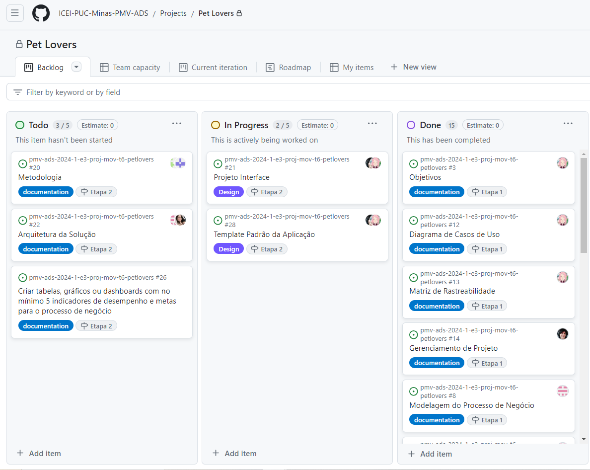

# Metodologia

As definições ferramentais utilizadas nesse projeto, tanto para manutenção dos códigos quanto para organização e execução das tarefas estão apontadas na tabela abaixo:

## Relação de Ambiente de Trabalho
| Ambiente| Plataforma | Link de Acesso |
|---------|------------|----------------|
| Repositório de código fonte | GitHub |[Github](https://github.com/ICEI-PUC-Minas-PMV-ADS/pmv-ads-2024-1-e3-proj-mov-t6-petlovers)|
| Diagramas | Canva | [Canva](https://www.canva.com/design/DAF-SRjfrhc/WZFIN5xfBkYXUpTRyveAhw/edit)|
| Projeto de Interface e Wireframes | Figma | [Figma](https://www.figma.com/file/2Hs6QHz5WXsqocqcSdncLB/PetLover?type=design&node-id=0%3A1&mode=design&t=3AAeg3pPom0kkpvc-1)|
| Gerenciamento do Projeto | Github | [Github](https://github.com/orgs/ICEI-PUC-Minas-PMV-ADS/projects/833/views/1)| .|

## Controle de Versão
A ferramenta de controle de versão adotada no projeto foi o
[Git](https://git-scm.com/), sendo que o [Github](https://github.com/ICEI-PUC-Minas-PMV-ADS/pmv-ads-2024-1-e3-proj-mov-t6-petlovers)
foi utilizado para hospedagem do repositório.

O projeto segue a seguinte convenção para o nome de branches:

- `main`: versão estável já testada do software
- `testing`: versão em testes do software
- `dev`: versão de desenvolvimento do software

Quanto à gerência de issues, o projeto adota a seguinte convenção para
etiquetas:

- `documentation`: melhorias ou acréscimos à documentação
- `bug`: uma funcionalidade encontra-se com problemas
- `enhancement`: uma funcionalidade precisa ser melhorada
- `feature`: uma nova funcionalidade precisa ser introduzida

Foi disponibilizado um repositório para a equipe no Github e, a partir da *branch* *main* serão criadas as branches *testing* e *dev*.    
Cada membro do time precisará clonar o repositório, realizar as edições e os desenvolvimentos (na *branch *dev*) e, após a conclusão precisará ser criada uma *pull request* para a *branch* *testing*.  
Somente quando for aprovada, os testes deverão ser realizados.   
Por fim, os membros deverão criar uma nova *pull* *request*, dessa vez para a *branch* *main*, tendo dois *pipelines* para aplicação, sendo um para o ambiente de teste (*branch* *testing*) e, a partir da *branch*, mais uma para o ambiente de produção. 

## Gerenciamento do Projeto
A equipe utiliza metodologias ágeis, tendo escolhido o Scrum como base para definição do processo de desenvolvimento.

### Divisão de Papéis
|Funções|Colaborador|
|---------|------------|
| Scrum Master:| Ana Beatriz Leite de Souza|
| Product Owner:| Alissa Nishihara|
| Equipe de Desenvolvimento:|Ana Beatriz Leite de Souza|
| |Alissa Nishihara|
| |Fernanda Bandeira Pinheiro|
| |Liana Cristina Vieira Santos Nagasawa|
| |Maria Teresa Abreu Martins De Paiva Azevedo |
| |Pedro Victor Ferreira De Assis|
| Equipe de Designer:| Alissa Nishihara |

### Processo
Para organização e distribuição das tarefas desse projeto, a equipe está utilizando o Github, estruturado com Recursos: Backlog, ToDo, In Progress, e Done. 
O quadro do Github está disponível através da URL: [Github](https://github.com/orgs/ICEI-PUC-Minas-PMV-ADS/projects/833/views/1)

*Figura 1 - Tela Github utilizada pelo grupo*

### Ferramentas
As ferramentas empregadas no projeto são:

| Ferramenta | Descrição |
|---------|------------|
| Editor de código | Visual Studio Code |
| Linguagem Utilizada | Framework React Native |
| Para Comunicação | Microsoft Teams|
| | WhatsApp|
| Interface | Figma|
| Diagrama | Draw.io|

O Visual Studio Code foi escolhido por possuir uma integração com o sistema de versão. 
Como ferramentas de comunicação formam escolhidas o Microsoft Teams, por ser a ferramenta disponibillizada pela Instituição para orientação do projeto, e o WhatsApp,  por facilitar o acesso às informações e promover uma interação mais dinâmica com os membros do projeto. 
A ferramenta Figma foi escolhida para desenvolver a interface do projeto por permitir que vários membros trabalhem juntos, compartilhando alterações instantaneamente.
Sendo o GitHub, uma plataforma de desenvolvimento colaborativo que utiliza o sistema de controle de versões chamado Git, foi escolhido por permitir uma colaboração transparente de todos os membros, com alto nível de rastreabilidade de código e de fácil implantação. 
Por fim, para criar diagramas utilizamos o Draw.io por melhor captar as necessidades da nossa solução, sendo uma ferramenta de custo zero e que permite o compartilhamento com os membros.

 

