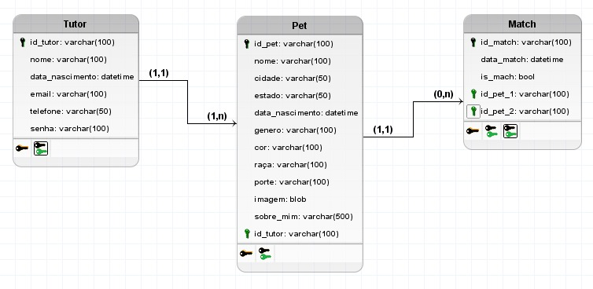

# Arquitetura da Solução

Pré-requisitos: <a href="3-Projeto de Interface.md"> Projeto de Interface</a>

Definição de como o software é estruturado em termos dos componentes que fazem parte da solução e do ambiente de hospedagem da aplicação.

## Diagrama de Classes

Este diagrama apresenta o estudo do fluxo de interação do usuário com o sistema interativo.

 *Diagrama de Classes PetLovers*

## Modelo ER

O Modelo ER representa através de um diagrama como as entidades (coisas, objetos) se relacionam entre si na aplicação interativa.]

 *Diagrama Relacional PetLovers*

## Esquema Relacional

O Esquema Relacional corresponde à representação dos dados em tabelas juntamente com as restrições de integridade e chave primária.

.
 *Esquema Relacional PetLovers*

## Modelo Físico

Entregar um arquivo banco.sql contendo os scripts de criação das tabelas do banco de dados. Este arquivo deverá ser incluído dentro da pasta src\bd.

## Tecnologias Utilizadas

- Linguagem: JavaScript
- Biblioteca: React Native
- IDE: Visual Studio Code
- Ferramenta Wireframes: Figma
- Ferramenta de Comunicação: Whatsapp e Teams
- Ferramenta de Gestão de Projeto: Github Projects
- Sistema de Gerenciamento de Banco de Dados: MySQL

## Hospedagem

Explique como a hospedagem e o lançamento da plataforma foi feita.

> **Links Úteis**:
>
> - [Website com GitHub Pages](https://pages.github.com/)
> - [Programação colaborativa com Repl.it](https://repl.it/)
> - [Getting Started with Heroku](https://devcenter.heroku.com/start)
> - [Publicando Seu Site No Heroku](http://pythonclub.com.br/publicando-seu-hello-world-no-heroku.html)

## Qualidade de Software

Para medirmos o padrão de qualidade de um aplicativo de relacionamento para pets, foram utilizados os requisitos de segurança, usabilidade, desempenho das funcionalidades e manutenbilidade.

- 	Funcionalidade: O aplicativo deve fornecer todas as funcionalidades necessárias para editar o perfil de um usuário, envio de mensagens para o perfil de match. 
- Usabilidade: O aplicativo deve ser fácil de usar e intuitivo, com uma interface clara e organizada que permita aos usuários navegar facilmente pelas diferentes funcionalidades. 
- Desempenho: O aplicativo deve ser rápido e responsivo, com tempos de carregamento curtos e operações suaves. Ele deve ser capaz de realizar troca de dados de forma rápida e objetiva. 
- Segurança: O aplicativo deve proteger as informações pessoais do usuário, incluindo dados sensiveis. 
- Manutenibilidade: O aplicativo deve ser fácil de manter e atualizar, com um código bem estruturado e documentado que permita a correção de bugs e a implementação de novas funcionalidades. Ele também deve ser capaz de armazenar feedbacks dos usuarios, para realização das correções necessárias

