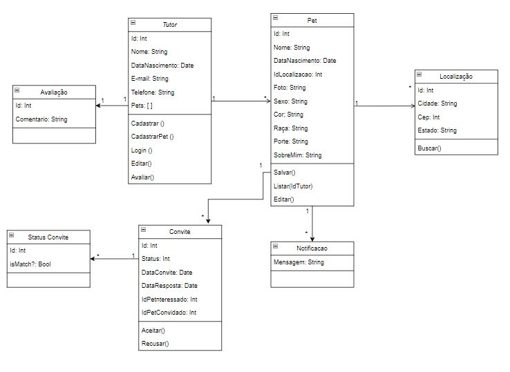
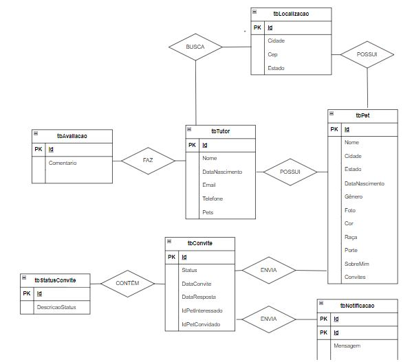

# Arquitetura da Solução

Pré-requisitos: <a href="3-Projeto de Interface.md"> Projeto de Interface</a>

Definição de como o software é estruturado em termos dos componentes que fazem parte da solução e do ambiente de hospedagem da aplicação.

## Diagrama de Classes

Este diagrama apresenta o estudo do fluxo de interação do usuário com o sistema interativo.

 *Diagrama de Classes PetLovers*

## Modelo ER

O Modelo ER representa através de um diagrama como as entidades (coisas, objetos) se relacionam entre si na aplicação interativa.]

 *Diagrama Relacional PetLovers*

## Esquema Relacional

Estamos utilizando nesse projeto o Firestore, banco de dados NoSQL da Google que não utiliza o conceito tradicional de esquema relacional encontrado em bancos de dados SQL. Em vez disso, ele adota uma estrutura de dados baseada em coleções de documentos JSON-like.  

Os relacionamentos são modelados através de referências entre documentos usando campos que contêm identificadores (IDs) de outros documentos. Não há suporte nativo para joins como em bancos de dados SQL; em vez disso, estruturamos os dados de modo que as consultas possam recuperar documentos relacionados de maneira eficiente, como mostra a imagem abaixo que referencia o ID do usuário na coleção de pets.

  

## Modelo Físico

No Firestore não há um modelo físico estruturado como nos bancos de dados relacionais tradicionais, como MySQL ou PostgreSQL. Os dados são organizados em coleções que contêm documentos, e cada documento é uma unidade de armazenamento que contém dados em formato JSON. Para criar uma coleção e adicionar documentos a ela, fizemos  diretamente pelo nosso código.

Abaixo está uma imagem mostrando todas as coleções criadas no Firebase dentro da pasta models, juntamente com um exemplo de código utilizado:  

## Tecnologias Utilizadas

- Linguagem: JavaScript
- Biblioteca: React Native
- Backend- Node.js e TypeScript
- IDE: Visual Studio Code
- Ferramenta Wireframes: Figma
- Ferramenta de Comunicação: Whatsapp e Teams
- Ferramenta de Gestão de Projeto: Github Projects
- Sistema de Gerenciamento de Banco de Dados: Firebase 

## Hospedagem

Explique como a hospedagem e o lançamento da plataforma foi feita.

## Qualidade de Software

Para medirmos o padrão de qualidade de um aplicativo de relacionamento para pets, foram utilizados os requisitos de segurança, usabilidade, desempenho das funcionalidades e manutenbilidade.

- 	Funcionalidade: O aplicativo deve fornecer todas as funcionalidades necessárias para editar o perfil de um usuário, envio de mensagens para o perfil de match. 
- Usabilidade: O aplicativo deve ser fácil de usar e intuitivo, com uma interface clara e organizada que permita aos usuários navegar facilmente pelas diferentes funcionalidades. 
- Desempenho: O aplicativo deve ser rápido e responsivo, com tempos de carregamento curtos e operações suaves. Ele deve ser capaz de realizar troca de dados de forma rápida e objetiva. 
- Segurança: O aplicativo deve proteger as informações pessoais do usuário, incluindo dados sensiveis. 
- Manutenibilidade: O aplicativo deve ser fácil de manter e atualizar, com um código bem estruturado e documentado que permita a correção de bugs e a implementação de novas funcionalidades. Ele também deve ser capaz de armazenar feedbacks dos usuarios, para realização das correções necessárias

|Característica de Qualidade| Subcaracterísticas |Justificativa      |
|--------------------|------------------------------------|----------------------------------------|
| ● Adequação Funcional  |         Adequação            Acurácia        Conformidade  | Prover um conjunto apropriado de funções para tarefas e objetivos do usuário especificados.    Prover, com o grau de precisão necessário, resultados ou efeitos corretos ou conforme acordados.   O software deve estar de acordo com normas, convenções ou regulamentações previstas em leis e prescrições similares relacionadas à funcionalidade.
|    ●  Eficiência de Desempenho          |   Comportamento em relação aos recursos           |  Capacidade do produto de software de usar tipos e quantidades apropriados de recursos, quando o software executa suas funções sob condições estabelecidas.
|● Usabilidade                            |    Inteligibilidade         Apreensibilidade         Operacionalidade     |  Capacidade do produto de software de possibilitar ao usuário compreender se o software é apropriado e como ele pode ser usado para tarefas e condições de uso específicas.      Capacidade do produto de software de possibilitar ao usuário aprender sua aplicação.      Capacidade do produto de software de possibilitar ao usuário operá-lo e controlá-lo.
| ● Manutenibilidade   |   Modularidade         Modificabilidade         Testabilidade    |   A modularização (ou componentização) é o mecanismo que permite que um sistema de software seja dividido em partes que interagem entre si.     Capacidade do produto de software de permitir que uma modificação especificada seja implementada.      Capacidade do produto de software de permitir que o software, quando modificado, seja validado.
| ● Segurança   |  Confidencialidade             |Capacidade do produto de software de proteger informações e dados, de forma que pessoas ou sistemas não autorizados não possam lê-los nem modificá-los e que não seja negado o acesso às pessoas ou sistemas autorizados.

|Subcaracterísticas| Métrica |Escala      |Peso      |
|--------------------|------------------------------------|----------------------------------------|----------------------------------------|
|Adequação | O sistema propõe-se a fazer o que é apropriado? |1) Atende completamente  2) Atende parcialmente  3) Não atende       |ALTO      |
|Acurácia| O sistema gera resultados corretos conforme acordado?|1) Atende completamente  2) Atende parcialmente  3) Não atende    |ALTO        |
|Conformidade| O sistema está de acordo com normas e convenções previstas em leis e descrições similares?|1) Atende completamente  2) Atende parcialmente  3) Não atende     |ALTO        |
|Comportamento em relação aos recursos| Quanto recurso o sistema utiliza? |1) Muito  2) Suficiente  3) Pouco       |ALTO        |
|Interoperabilidade| O sistema é capaz de interagir com os sistemas especificados? |1) Atende completamente  2) Atende parcialmente  3) Não atende      |ALTO        |
|Inteligibilidade| É fácil entender como utilizar o software ? |1) Atende completamente  2) Atende parcialmente  3) Não atende      |ALTO        |
|Apreensibilidade| É fácil aprender a usar? |1) Atende completamente  2) Atende parcialmente  3) Não atende      |ALTO        |
|Operacionalidade| É fácil de operar e controlar a operação? |1) Atende completamente  2) Atende parcialmente  3) Não atende    |ALTO        |
|Modularidade| As partes (módulos) do sistema estão interagindo entre si ? |1) Atende completamente  2) Atende parcialmente  3) Não atende     |ALTO        |
|Modificabilidade| Qual a complexidade de implementar modificações ? |1) Alta  2) Média  3) Baixa      |ALTO        |
|Testabilidade| Qual a complexidade de se validar o software ?  |1) Alta  2) Média  3) Baixa       |ALTO        |
|Coexistência| O sistema de software pode coexistir com outros produtos de software independentes ? |1) Sim  2) Não       |ALTO        |
|Tolerância a falhas | Ocorrendo falhas, o sistema está parametrizado para reagir ? |1) Sim  2) Não       |ALTO        |
|Confidencialidade | O sistema evita acesso não autorizado, acidental ou deliberado a programas de dados? |1) Sim  2) Não       |ALTO        |
