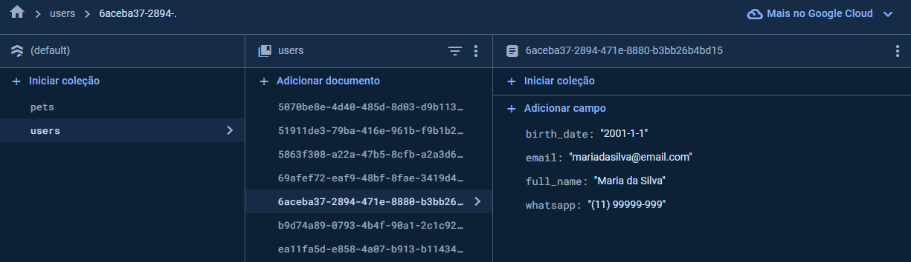

# Registro de Testes de Software

Relatório com as evidências dos testes de software realizados no sistema pela equipe, baseado em um plano de testes pré-definido. Clicar nas imagens para ver em tamanho maior.

| **Caso de Teste**| **CT-001: Cadastrar Usuários (Senha e Confirmação de Senha mascarados)** |
| :--- | :---: |
| Requisito associado | RF-01 O sistema deve possuir uma área para fazer cadastro de novos usuários a partir de 18 anos. |
| Objetivo do Teste | Verificar se os campos "Senha" e "Confirmação de Senha" são mascarados. |
| Procedimentos (passo à passo) | Acessar o aplicativo;   Selecionar no banner superior a opção "Cadastre o seu pet na nossa comunidade";    Assim que redirecionado para tela "Cadastro", preencher os campos obrigatórios (nome completo, data de nascimento, e-mail, contato, senha e confirmação de senha) |
| Resultado esperado | Campo de senha mascarado |
| Avaliação | O sistema mascarou os campos de senha na página de cadastro e também na página de login |
| Evidência |   |

  

| **Caso de Teste**| **CT-002 Cadastrar Usuários (Formato Data de Nascimento)** |
| :--- | :---: |
| Requisito associado | RF-01 O sistema deve possuir uma área para fazer cadastro de novos usuários a partir de 18 anos. |
| Objetivo do Teste | Verificar se o aplicativo exibe erro para formatos incorretos do campo "data de nascimento". |
| Procedimentos (passo à passo) | Acessar o aplicativo;   Selecionar no banner superior a opção "Cadastre o seu pet na nossa comunidade";    Na tela "Cadastro", preencher o campo de data de nascimento com uma data inválida |
| Resultado esperado | Mensagem de erro de data inválida |
| Avaliação | O sistema validou a data inexistente inserida (30/02) e exibiu a mensagem de erro que pede ao usuário que insira uma data válida |
| Evidência |  |

  

| **Caso de Teste**| **CT-03 Cadastrar Usuários (Menores 18 anos)** |
| :--- | :---: |
| Requisito associado | RF-01 O sistema deve possuir uma área para fazer cadastro de novos usuários a partir de 18 anos. |
| Objetivo do Teste | Verificar se o aplicativo permite cadastro de menores de 18 anos. |
| Procedimentos (passo à passo) | Acessar o aplicativo;   Selecionar no banner superior a opção "Cadastre o seu pet na nossa comunidade";    Na tela "Cadastro", preencher data de nascimento de uma pessoa menor de 18 anos |
| Resultado esperado | Mensagem de erro informando que o usuário deve ter mais de 18 anos |
| Avaliação | O sistema validou a data inserida e calculou a idade do usuário, exibindo a mensagem de erro que diz que apenas usuários maiores de 18 anos podem se cadastrar  |
| Evidência |  |

  

| **Caso de Teste**| **CT-04 Cadastrar Usuários (Preenchimento correto)** |
| :--- | :---: |
| Requisito associado | RF-01 O sistema deve possuir uma área para fazer cadastro de novos usuários a partir de 18 anos. |
| Objetivo do Teste | Verificar se é possível ir para tela "Cadastro de pet" após cadastro bem sucedido de usuário |
| Procedimentos (passo à passo) | Acessar o aplicativo;   Selecionar no banner superior a opção "Cadastre o seu pet na nossa comunidade";    Na tela "Cadastro", preencher os campos obrigatórios corretamente;    Apertar no botão "Cadastrar";    Verificar se a requisição de cadastro foi bem sucedida;    Observar se o aplicativo leva automaticamente à tela "Cadastro Pet" logo em seguida |
| Resultado esperado | Os dados do usuário devem constar na Firestore e ele deve ser direcionado à tela "Cadastro Pet" |
| Avaliação | O servidor recebeu a requisição e os dados foram armazenados corretamente na Firestore, com campo de senha ocultado por segurança. Em seguida, o aplicativo direcionou à tela "Cadastro Pet", que recebeu o ID de usuário como parâmetro  |
| Evidência |      |

  

| **Caso de Teste**| **CT-05 Cadastrar Usuários (Upload de imagens)** |
| :--- | :---: |
| Requisito associado | RF-02 O sistema deve permitir cadastrar o perfil de um animal de estimação, com a opção de fazer o upload de imagens. |
| Objetivo do Teste | Verificar se é possível inserir imagem na tela "Cadastro de Pet" |
| Procedimentos (passo à passo) | Acessar o aplicativo;   Selecionar no banner superior a opção "Cadastre o seu pet na nossa comunidade";    Na tela "Cadastro", preencher os campos obrigatórios corretamente;    Apertar no botão "Cadastrar";   Na tela "Cadastro Pet", selecionar o ícone e adicionar uma imagem |
| Resultado esperado | A imagem inserida deverá aparecer na tela |
| Avaliação | A imagem inserida apareceu corretamente na tela  |
| Evidência |  |

  

| **Caso de Teste**| **CT-06 Cadastrar Usuários (Cadastro pet)** |
| :--- | :---: |
| Requisito associado | RF-02 O sistema deve permitir cadastrar o perfil de um animal de estimação, com a opção de fazer o upload de imagens. |
| Objetivo do Teste | Verificar se é possível cadastrar um pet |
| Procedimentos (passo à passo) | Acessar o aplicativo;   Selecionar no banner superior a opção "Cadastre o seu pet na nossa comunidade";    Na tela "Cadastro", preencher os campos obrigatórios corretamente;    Apertar no botão "Cadastrar";   Na tela "Cadastro Pet", preencher todos os campos corretamente;   Apertar no botão "Cadastrar;   Verificar se a requisição de cadastro foi bem sucedida |
| Resultado esperado | Os dados do pet devem constar na Firestore e a tabela deve estar associada ao ID correto de usuário |
| Avaliação | O servidor recebeu a requisição e os dados foram armazenados corretamente na Firestore, com o ID de usuário correto  |
| Evidência |   |

  

| **Caso de Teste**| **CT-07 Cadastrar Usuários (Não permite cadastro sem o nome do pet)** |
| :--- | :---: |
| Requisito associado | RF-02 O sistema deve permitir cadastrar o perfil de um animal de estimação, com a opção de fazer o upload de imagens. |
| Objetivo do Teste | Verificar se o aplicativo permite o cadastro do pet sem a informação "Nome do pet" preenchida |
| Procedimentos (passo à passo) | Na tela "Cadastro Pet", preencher todos os campos exceto "Nome do pet";   Apertar no botão "Cadastrar;   Verificar se é exibida mensagem de erro correspondente |
| Resultado esperado | O cadastro não deverá ser realizado e a mensagem "Informe o nome do pet" deverá aparecer na tela |
| Avaliação | O cadastro de pet não foi enviado com o campo "Nome" em branco, e foi exibida a mensagem de erro  |
| Evidência |  |

  

| **Caso de Teste**| **CT-08 Cadastrar Usuários (Não permite cadastro sem o "sobre" do pet)** |
| :--- | :---: |
| Requisito associado | RF-02 O sistema deve permitir cadastrar o perfil de um animal de estimação, com a opção de fazer o upload de imagens. |
| Objetivo do Teste | Verificar se o aplicativo permite o cadastro do pet sem a informação "Sobre" preenchida |
| Procedimentos (passo à passo) | Na tela "Cadastro Pet", preencher todos os campos exceto "Sobre";   Apertar no botão "Cadastrar;   Verificar se é exibida mensagem de erro correspondente |
| Resultado esperado | O cadastro não deverá ser realizado e a mensagem "Forneça informações sobre o pet" deverá aparecer na tela |
| Avaliação | O cadastro de pet não foi enviado com o campo "Sobre" em branco, e foi exibida a mensagem de erro  |
| Evidência |  |

  

| **Caso de Teste**| **CT-09 Cadastrar Usuários (Não permite cadastro sem informar sexo do pet)** |
| :--- | :---: |
| Requisito associado | RF-02 O sistema deve permitir cadastrar o perfil de um animal de estimação, com a opção de fazer o upload de imagens. |
| Objetivo do Teste | Verificar se o aplicativo permite o cadastro do pet sem a informação "Sexo" preenchida |
| Procedimentos (passo à passo) | Na tela "Cadastro Pet", preencher todos os campos exceto "Sexo";   Apertar no botão "Cadastrar;   Verificar se é exibida mensagem de erro correspondente |
| Resultado esperado | O cadastro não deverá ser realizado e a mensagem "Informe o sexo do pet" deverá aparecer na tela |
| Avaliação | O cadastro de pet não foi enviado com o campo "Sexo" em branco, e foi exibida a mensagem de erro  |
| Evidência |  |

  

| **Caso de Teste**| **CT-10 Cadastrar Usuários (Não permite cadastro sem a informação Raça)** |
| :--- | :---: |
| Requisito associado | RF-02 O sistema deve permitir cadastrar o perfil de um animal de estimação, com a opção de fazer o upload de imagens. |
| Objetivo do Teste | Verificar se o aplicativo permite o cadastro do pet sem a informação "Raça" preenchida |
| Procedimentos (passo à passo) | Na tela "Cadastro Pet", preencher todos os campos exceto "Raça";   Apertar no botão "Cadastrar;   Verificar se é exibida mensagem de erro correspondente |
| Resultado esperado | O cadastro não deverá ser realizado e a mensagem "Informe a raça do pet" deverá aparecer na tela |
| Avaliação | O cadastro de pet não foi enviado com o campo "Raça" em branco, e foi exibida a mensagem de erro  |
| Evidência |  |

  

| **Caso de Teste**| **CT-11 Cadastrar Usuários (Não permite cadastro sem a informação Porte)** |
| :--- | :---: |
| Requisito associado | RF-02 O sistema deve permitir cadastrar o perfil de um animal de estimação, com a opção de fazer o upload de imagens. |
| Objetivo do Teste | Verificar se o aplicativo permite o cadastro do pet sem a informação "Porte" preenchida |
| Procedimentos (passo à passo) | Na tela "Cadastro Pet", preencher todos os campos exceto "Porte";   Apertar no botão "Cadastrar;   Verificar se é exibida mensagem de erro correspondente |
| Resultado esperado | O cadastro não deverá ser realizado e a mensagem "Informe o porte do pet" deverá aparecer na tela |
| Avaliação | O cadastro de pet não foi enviado com o campo "Porte" em branco, e foi exibida a mensagem de erro  |
| Evidência |  |

  

| **Caso de Teste**| **Verificar se o aplicativo permite o cadastro do pet sem a informação "Idade" preenchida** |
| :--- | :---: |
| Requisito associado | RF-02 O sistema deve permitir cadastrar o perfil de um animal de estimação, com a opção de fazer o upload de imagens. |
| Objetivo do Teste | Verificar se o aplicativo permite o cadastro do pet sem a informação "Idade" preenchida |
| Procedimentos (passo à passo) | Na tela "Cadastro Pet", preencher todos os campos exceto "Idade";   Apertar no botão "Cadastrar;   Verificar se é exibida mensagem de erro correspondente |
| Resultado esperado | O cadastro não deverá ser realizado e a mensagem "Informe a idade do pet" deverá aparecer na tela |
| Avaliação | O cadastro de pet não foi enviado com o campo "Idade" em branco, e foi exibida a mensagem de erro  |
| Evidência |  |

  

| **Caso de Teste**| **CT-16 Login (Validar formato e-mail)** |
| :--- | :---: |
| Requisito associado | RF-009 O site deve possuir uma página de login |
| Objetivo do Teste | Verificar se o aplicativo permite o login com e-mail em formato errado |
| Procedimentos (passo à passo) | Acessar o aplicativo;   No menu inferior, clicar no ícone de login;    Na tela "Login", preencher o e-mail em formato inválido;    Apertar no botão "Login"  |
| Resultado esperado | O login não deverá ser realizado e uma mensagem de erro deverá ser exibida |
| Avaliação | Com entrada de e-mail em formato inválido, o login não foi efetuado, no entanto não houve mensagem de erro  |
| Evidência |  |

  

| **Caso de Teste**| **CT-20 Login (Teste de senha incorreta)** |
| :--- | :---: |
| Requisito associado | RF-009 O site deve possuir uma página de login |
| Objetivo do Teste | Verificar se o aplicativo permite o login com senha inválida |
| Procedimentos (passo à passo) | Acessar o aplicativo;   No menu inferior, clicar no ícone de login;    Na tela "Login", preencher o e-mail de usuário;   Preencher uma senha inválida (diferente da cadastrada);    Apertar no botão "Login"  |
| Resultado esperado | O login não deverá ser realizado e uma mensagem de erro deverá ser exibida |
| Avaliação | Com entrada de senha inválido, o login não foi efetuado, e foi exibida mensagem de erro do Firebase  |
| Evidência |  |

  

|Caso de Teste         |CT-23  Modificar dados do usuário |
|----------------------|--------------------------|
|Requisito Associado   |**RF-03**   O sistema deve permitir que o usuário modifique suas informações. |
|Objetivo do Teste| Verificar se o usuário consegue modificar suas informações. |
|Passos |Na página inicial, clique no ícone de usuário para ser redirecionado para a página de login.  Insira sua credenciais  válidas.   Clique no ícone de usuário na barra de navegação inferior. Você será redirecionado para a tela "Meu Perfil".  Clique em "Editar meus dados".  Modifique o campo necessário e clique em "Salvar". |
|Critério de Êxito|   Um alerta aparecerá na tela informando que as novas informações foram salvas, e esses novos dados serão alterados no firebase .|
| Evidência | |

https://github.com/ICEI-PUC-Minas-PMV-ADS/pmv-ads-2024-1-e3-proj-mov-t6-petlovers/assets/93337008/c08c65a2-24ca-4a62-8342-a7882c85d24d

  

|Caso de Teste         |CT-24  Modificar dados do pet |
|----------------------|--------------------------|
|Requisito Associado   |**RF-03**   O sistema deve permitir que o usuário modifique as informações do seu pet. |
|Objetivo do Teste| Verificar se o usuário consegue modificar suas informações. |
|Passos |   Na página inicial, clique no ícone de usuário para ser redirecionado para a página de login.   Insira sua credenciais  válidas.   Clique no ícone de usuário na barra de navegação inferior. Você será redirecionado para a tela "Meu Perfil".  Clique em "Editar dados pet".  Modifique o campo necessário e clique em "Salvar". |
|Critério de Êxito|   Um alerta aparecerá na tela informando que as novas informações foram salvas, e esses novos dados serão alterados no firebase .|
| Evidência | |

https://github.com/ICEI-PUC-Minas-PMV-ADS/pmv-ads-2024-1-e3-proj-mov-t6-petlovers/assets/93337008/e52c0713-5805-45fa-a47e-0c459169fef8

  

|Caso de Teste         |CT-25  Excluir conta do usuário e do pet vinculado |
|----------------------|--------------------------|
|Requisito Associado   |**RF-03**   O sistema deve permitir que o usuário modifique suas informações. |
|Objetivo do Teste| Verificar se o usuário consegue modificar suas informações. |
|Passos |   Na página inicial, clique no ícone de usuário para ser redirecionado para a página de login.   Insira sua credenciais  válidas.   Clique no ícone de usuário na barra de navegação inferior. Você será redirecionado para a tela "Meu Perfil".  Clique em "Excluir conta".   Um alerta aparecerá na tela confirmando a exclusao . |
|Critério de Êxito|  A conta será excluída do Firebase junto com o pet vinculado, e o usuário não conseguirá mais acessar a aplicação com suas credenciais.|
| Evidência | Vídeo de teste abaixo |

Obs: Por questões de segurança, ao gravar a tela do celular, a senha é ocultada, por isso ela não aparece no vídeo quando digitada.

https://github.com/ICEI-PUC-Minas-PMV-ADS/pmv-ads-2024-1-e3-proj-mov-t6-petlovers/assets/93337008/9576f04a-0d96-4f1e-9d82-c1558de8cd36

  

| Caso de Teste         | CT-26  Buscar Perfis de Outros Pets e visualizar suas informações |
|----------------------|--------------------------|
| Requisito Associado   | **RF-004**   O sistema deve ter uma área para buscar|
| Objetivo do Teste | Verificar se o usuário consegue buscar e visualizar o perfil dos pets corretamente. |
| Passos |   Na página inicial, clique em ver mais ou em buscar.   Na barra de pesquisa insira o nome ou a característica do pet que deseja buscar.   Clique no botão de busca .   Verifique se a lista de resultados é exibida corretamente deslizando para direita ou esquerda.   Para visualizar os detalhes clique no ícone do meio. |
| Critério de Êxito |   A busca deve retornar uma lista de perfis de pets que correspondem aos critérios inseridos.   O usuário deve ser capaz de visualizar os detalhes de um perfil de pet selecionado.|
| Evidência | Vídeo de teste abaixo |

https://github.com/ICEI-PUC-Minas-PMV-ADS/pmv-ads-2024-1-e3-proj-mov-t6-petlovers/assets/93337008/6f4515e7-3b3e-4c53-882b-348982a50205

  

| Caso de Teste         | CT-27  Dar Like ou Dislike em Perfis de Outros Pets |
|----------------------|--------------------------|
| Requisito Associado   | **RF-005**   O sistema deve permitir que o usuário consiga dar like ou dislike em perfis de outros pets. |
| Objetivo do Teste | Verificar se o usuário consegue dar like ou dislike em perfis de outros pets corretamente. |
| Passos |   Na página inicial, clique em ver mais, e na barra de busca  insira o nome ou a característica do pet que deseja encontrar.   Clique no botão Buscar.   Deslize para a direita (Like).   Deslize para a esquerda (Dislike).  |
| Critério de Êxito |   O sistema deve registrar corretamente a ação de like ou dislike no perfil do pet mostrando um alerta na tela.   Em caso de like, os dados serão salvos na coleção "matches" no Firebase, e o valor de isMatch será definido como false, tornando-se true caso o outro pet também dê like. |
| Evidência | 
|

https://github.com/ICEI-PUC-Minas-PMV-ADS/pmv-ads-2024-1-e3-proj-mov-t6-petlovers/assets/93337008/292475cd-77ac-4adb-b094-70eea974fcb9

  

## Avaliação

As funcionalidades de cadastro de usuário, pet vinculado e login de usuário estão funcionando corretamente. Os dados preenchidos nos formulários de cadastro estão sendo enviados à Firestore, e os dados específicos de autenticação (e-mail e senha) estão sendo enviados ao Firebase Authentication. 

Atualmente, algumas validações ainda não estão ocorrendo em tempo real (antes de apertar o botão de enviar) ou com mensagem de erro adequada. No entanto, a aplicação não envia o cadastro e/ou login de usuário com dados inválidos, funcionando apenas em casos de êxito do preenchimento dos formulários. 

